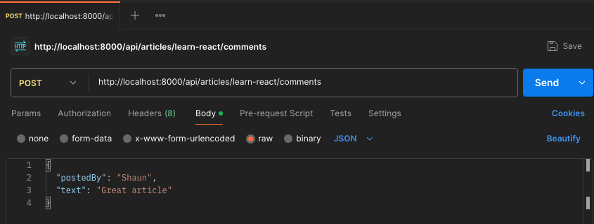

# Chapter 3 - Adding MongoDB to Node.js
## Lesson 5 - Rewriting the comments endpoint

In the last lesson we updated the upvote endpoint to query the MongoDB database instead of a static array.

Let's update the comments endpoint to use MongoDB. The "comments" property of an article holds an array of comments consisting of "postedBy" & "text" properties. For a visual, a single article looks something like this: 
<pre>
{
  name: 'Shaun',
  upvotes: 1,
  comments: [
    {
      postedBy: 'Shaun',
      text: 'An amazing article'
    },
  ]
}
</pre>

So the task will be to add a new comment to a record. 
In the last lesson we learned about *$inc* to increment a field. MongoDB also has a *$push* property that helps us push a new value onto an array. We can combine this with the *findOneAndUpdate()* method. 
* update the callback to use *async*
* gather the "name" url paramter
* gather the "postedBy" and "text" from the body of the request
* use findOneAndUpdate() to find an article using the "name" url parameter
* and update the article by using *$push* to add another comment to the array

<pre>
app.post('/api/articles/:name/comments', async (req, res) => {
  const { name } = req.params;
  const { postedBy, text } = req.body;
  const newComment = { postedBy, text } ;

  const updatedArticle = await db.collection('articles').findOneAndUpdate({ name }, {
    $push: { comments: newComment }
  }, {
    returnDocument: "after"
  });
  
  res.json(updatedArticle);
});
</pre>

With these changes it's time to test it out. Start up your database and web server if they are not already running. Then go to Postman and make a new POST request with a raw JSON body. 

<figure>
  <figcaption>Postman Example : POST request with JSON data</figcaption>
  
</figure>

If all went well Postman will respond with an article for *learn-react* with the new comment added to the "comments" array.

Finally we can delete the static *articleInfo* array we were using earlier in the course before we created and populated a new MongoDB database. 

"Delete the articleInfo array from src/server.js" 
<pre>
...
// Delete this array
const articleInfo = [
  { name: 'learn-node', upvotes: 0, comments: []},
  { name: 'learn-react', upvotes: 0, comments: []},
  { name: 'mongodb', upvotes: 0, comments: []},
];
...
</pre>
